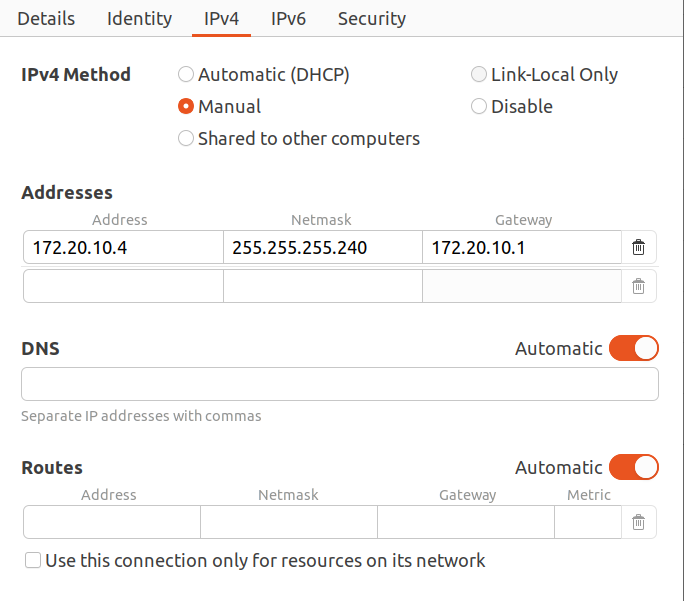

# SMART FRIDGE API

## SCARICARE IL PROGETTO IN LOCALE

### 1. creare ambiente virtuale con conda

```bash
conda create -n iot_server python=3.12.4
```

### 2. da /iot_projects installare i requirements

```bash
 pip install -r requirements.txt
```

### 3. controllare che tutto funzioni correttamente eseguendo i tests

```bash
python3 manage.py test
```

## ESEGUIRE IL SERVER SU UN INDIRIZZO IP PUBBLICO

### 1. Rendere il proprio ip statico sulla rete locale(hotspot) per far funzionare MITApp Inventor


<br>
->Impostare come ipv4 address: 172.20.10.4 (oppure vedi nella tua rete)
->Controllare la netmask con ifconfig  
->Gateway: 172.20.10 (opppure vedi nella tua rete)

### 2. eseguire il server

```bash
python3 manage.py runserver 0.0.0.0:8080
```

Se si vuole anche inizializzare il database con info di deafult

```bash
python3 manage.py populate_db
python3 manage.py runserver 0.0.0.0:8080
```

### 3. controllare la documentazione alla pagina /api

http://172.20.10.4:8080/api/

## FARE RICHIESTE COME SUPEUTENTE AUTENTICATO

Inserire nell'header della richiesta 'Token 62aa1bd2271eedd587232a3259f262fa5b578d88'
(Dopo aver fatto pull del progetto perchè il database si è aggiornato)
